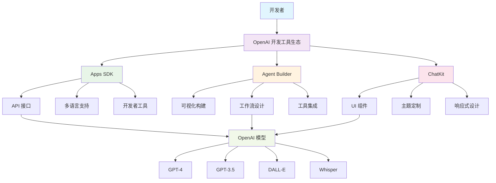
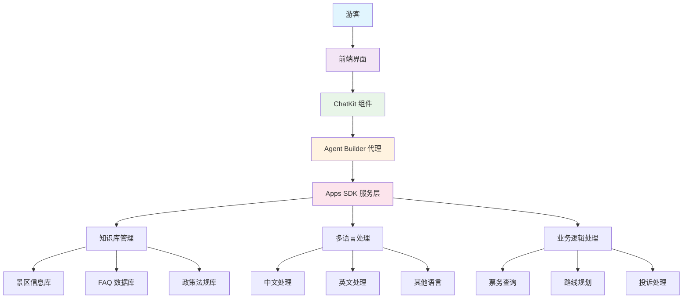

# OpenAI 开发工具指南

## 概述

OpenAI 提供了一套完整的开发工具，帮助开发者快速构建基于 AI 的应用程序。本指南将介绍三个核心工具：Apps SDK、Agent Builder 和 ChatKit，并以景区客服系统为例展示实际应用。

## 核心工具介绍

### 1. OpenAI Apps SDK

**功能特点：**
- 统一的 API 接口，支持多种 AI 模型
- 多语言支持（Python、JavaScript、Go 等）
- 完整的开发者工具和文档
- 支持文本生成、图像生成、语音处理等功能

**适用场景：**
- 自定义 AI 应用开发
- 复杂业务逻辑集成
- 高性能应用构建

### 2. Agent Builder

**功能特点：**
- 可视化拖拽界面
- 工作流设计和自动化
- 外部工具和服务集成
- 一键部署和监控

**适用场景：**
- 快速原型开发
- 业务流程自动化
- 非技术用户创建 AI 代理

### 3. ChatKit

**功能特点：**
- 预构建的聊天界面组件
- 响应式设计
- 主题和样式定制
- 丰富的交互功能

**适用场景：**
- 快速构建聊天应用
- 用户界面标准化
- 移动端和 Web 端适配

## 工具架构图



## 工具选择指南

| 需求场景 | 推荐工具 | 理由 |
|---------|---------|------|
| 复杂业务逻辑 | Apps SDK | 提供最大的灵活性和控制力 |
| 快速原型验证 | Agent Builder | 可视化构建，快速迭代 |
| 标准化聊天界面 | ChatKit | 预构建组件，开发效率高 |
| 企业级应用 | Apps SDK + ChatKit | 结合使用，平衡灵活性和效率 |

## 开发流程建议

1. **需求分析** - 明确功能需求和用户场景
2. **工具选择** - 根据项目特点选择合适的工具组合
3. **原型开发** - 使用 Agent Builder 快速验证概念
4. **功能实现** - 使用 Apps SDK 实现核心业务逻辑
5. **界面集成** - 使用 ChatKit 构建用户界面
6. **测试部署** - 完整测试后部署到生产环境

---

# 景区客服系统项目指导

## 项目概述

基于 OpenAI 工具构建一个智能景区客服系统，为游客提供 7x24 小时的多语言服务支持。

## 系统架构



## 技术栈选择

### 前端层
- **ChatKit** - 构建聊天界面
- **React/Vue.js** - 框架支持
- **响应式设计** - 适配移动端

### 服务层
- **Agent Builder** - 创建客服代理
- **Apps SDK** - 实现业务逻辑
- **Node.js/Python** - 后端服务

### 数据层
- **知识库** - 景区信息存储
- **用户数据** - 对话历史记录
- **配置管理** - 系统参数设置

## 功能模块设计

### 1. 智能问答模块
```python
# 使用 Apps SDK 实现
from openai import OpenAI

class QAService:
    def __init__(self):
        self.client = OpenAI()
    
    def process_question(self, question, context):
        response = self.client.chat.completions.create(
            model="gpt-4",
            messages=[
                {"role": "system", "content": "你是慕田峪长城的专业客服助手"},
                {"role": "user", "content": f"问题：{question}\n上下文：{context}"}
            ]
        )
        return response.choices[0].message.content
```

### 2. 多语言支持
```python
class LanguageService:
    def detect_language(self, text):
        # 语言检测逻辑
        pass
    
    def translate_response(self, text, target_lang):
        # 翻译服务
        pass
```

### 3. 知识库管理
```python
class KnowledgeBase:
    def __init__(self):
        self.attractions_info = self.load_attractions_data()
        self.faq_data = self.load_faq_data()
    
    def search_relevant_info(self, query):
        # 知识库搜索逻辑
        pass
```

## 实施步骤

### 第一阶段：基础搭建（1-2周）
1. **环境准备**
   - 注册 OpenAI 账号
   - 配置开发环境
   - 准备测试数据

2. **基础功能实现**
   - 使用 ChatKit 创建聊天界面
   - 集成基本的问答功能
   - 实现简单的知识库查询

### 第二阶段：功能完善（2-3周）
1. **Agent Builder 集成**
   - 创建客服工作流
   - 配置业务规则
   - 集成外部服务

2. **多语言支持**
   - 实现语言检测
   - 添加翻译功能
   - 测试多语言场景

### 第三阶段：优化部署（1-2周）
1. **性能优化**
   - 响应时间优化
   - 并发处理能力
   - 错误处理机制

2. **部署上线**
   - 生产环境配置
   - 监控和日志
   - 用户反馈收集

## 数据准备

基于您的 demo.json 数据，我们可以构建以下知识库：

### 1. 景区信息库
```json
{
  "attractions": {
    "mutianyu_great_wall": {
      "name": "慕田峪长城",
      "opening_hours": "旺季: 7:00-18:30, 淡季: 8:00-17:30",
      "ticket_info": "成人票: 45元, 学生票: 25元",
      "transportation": "多种交通方式可选"
    }
  }
}
```

### 2. FAQ 数据库
```json
{
  "faq": [
    {
      "question": "什么时候开放？",
      "answer": "旺季: 周一至周五7:00-18:00; 周六、日7:00-18:30。淡季: 8:00-17:30",
      "category": "营业时间"
    }
  ]
}
```

## 成本估算

| 组件 | 月成本估算 | 说明 |
|------|-----------|------|
| OpenAI API | $200-500 | 根据调用量计算 |
| 服务器 | $50-100 | 云服务器费用 |
| 存储 | $20-50 | 数据存储费用 |
| 总计 | $270-650 | 中等规模部署 |

## 预期效果

1. **用户体验提升**
   - 24小时在线服务
   - 多语言支持
   - 快速响应

2. **运营效率提升**
   - 减少人工客服工作量
   - 标准化服务流程
   - 数据驱动的服务优化

3. **业务价值**
   - 提高客户满意度
   - 降低运营成本
   - 增强品牌形象

## 后续扩展

1. **功能扩展**
   - 语音交互支持
   - 图像识别功能
   - 个性化推荐

2. **技术升级**
   - 模型微调
   - 本地化部署
   - 边缘计算支持

3. **业务拓展**
   - 多景区支持
   - 旅游产品推荐
   - 数据分析报告

---

## 总结

通过合理使用 OpenAI 的开发工具，可以快速构建高质量的 AI 应用。景区客服系统项目展示了如何将这些工具结合使用，实现从概念到产品的完整开发流程。建议根据实际需求选择合适的工具组合，并遵循渐进式开发的原则。
