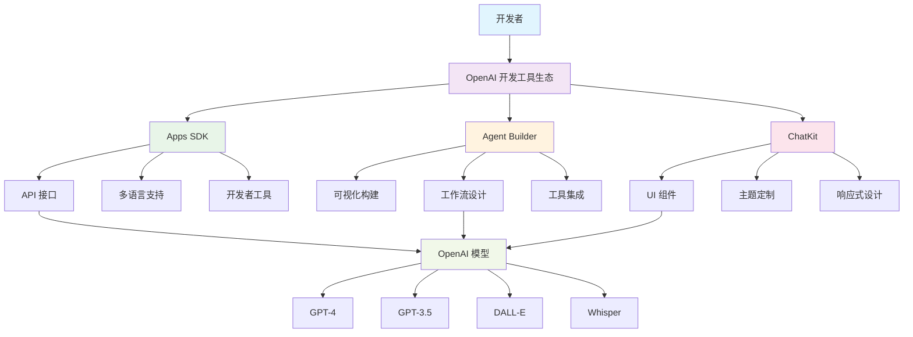
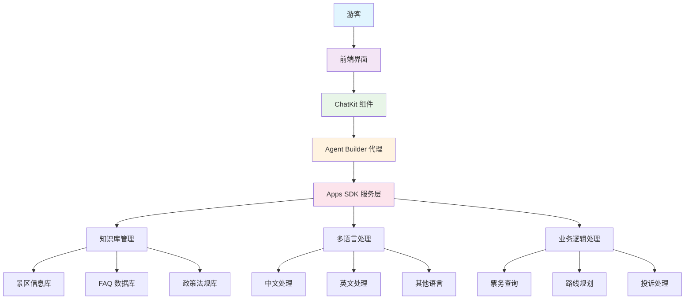

# OpenAI的三个工具：Apps SDK、Agent Builder 与 ChatKit

## 概述

本文将介绍：Apps SDK、Agent Builder 和 ChatKit，并以景区客服系统为例展示实际应用。

**整体架构：**
- **Apps SDK** → 开发者级别的编程接口层
- **Agent Builder** → 面向业务场景的无代码/低代码构建层  
- **ChatKit** → 前端聊天界面层（UI/UX组件）

## 核心工具介绍

### 1. OpenAI Apps SDK

**定位：**
为开发者提供统一的接口和 SDK，用于集成 OpenAI 模型、构建自定义 AI 应用。

**功能特点：**
- 提供对 GPT、Whisper、DALL·E 等模型的访问接口
- 支持多语言（Python、JavaScript、TypeScript 等）
- 可统一调用模型、文件、嵌入、工具（functions）、聊天、语音、图像等功能
- 支持流式输出与异步调用
- 集成 API Key 管理与速率限制控制

**适用场景：**
- 自定义 AI 助手开发
- 将 AI 能力嵌入现有产品（客服、内容生成、推荐系统）
- 高性能或分布式 AI 服务开发

### 2. Agent Builder

**定位：**
让非工程师用户也能通过图形化方式构建智能体（Agent），可与外部工具、API、数据库等集成。

**功能特点：**
- 可视化流程设计（拖拽式节点配置）
- 支持函数调用（Tool Calls）与多模型协作
- 集成外部 API、数据库、Webhook、CRM 等
- 一键部署与运行监控（如日志、调用状态）
- 允许为每个 Agent 设置自定义 system prompt 与 memory 模型

**适用场景：**
- 快速搭建 AI 客服、问答机器人、业务流程助手
- 企业内部知识工作自动化
- 无需代码即可原型验证

### 3. ChatKit

**定位：**
用于构建可嵌入任意网页或 App 的高质量聊天界面框架。

**功能特点：**
- 提供可定制的对话 UI 组件（卡片、按钮、富文本、Markdown、图片等）
- 响应式设计，支持 Web、iOS、Android
- 主题与样式高度可配置
- 支持流式消息更新、思考加载状态、引用信息展示
- 与 Agent Builder、Apps SDK 无缝集成

**适用场景：**
- 快速构建聊天类前端
- 为企业网站、App、公众号、小程序添加智能问答窗口
- 保持统一的交互体验

## 工具架构图



## 工具选择指南

| 需求场景 | 推荐工具 | 理由 |
|---------|---------|------|
| 自定义 AI 助手开发 | Apps SDK | 提供完整的编程接口，支持复杂业务逻辑 |
| 快速搭建客服机器人 | Agent Builder | 可视化配置，无需编程即可构建智能体 |
| 构建聊天界面 | ChatKit | 高质量 UI 组件，支持多种交互形式 |
| 企业级 AI 应用 | Apps SDK + Agent Builder + ChatKit | 三层架构，从后端到前端的完整解决方案 |
| 原型验证 | Agent Builder + ChatKit | 快速构建可演示的 AI 应用原型 |

## 开发流程建议

1. **需求分析** - 明确功能需求和用户场景
2. **架构设计** - 根据项目特点选择合适的工具组合
3. **快速原型** - 使用 Agent Builder 验证核心业务流程
4. **后端开发** - 使用 Apps SDK 实现复杂的业务逻辑和数据集成
5. **前端构建** - 使用 ChatKit 构建高质量的用户界面
6. **集成测试** - 确保三个工具层之间的无缝协作
7. **部署上线** - 完整的测试后部署到生产环境

---

# 景区客服系统项目指导

## 项目概述

基于 OpenAI 工具构建一个智能景区客服系统，为游客提供 7x24 小时的多语言服务支持。

## 系统架构



## 工具协作示例

在景区智能客服场景中，三个工具的协作方式：

- **Apps SDK** → 负责与模型交互、检索景区知识库、规划路线数据
- **Agent Builder** → 配置景区问答逻辑、天气查询、购票链接、路径导航等工作流
- **ChatKit** → 负责最终用户界面展示，包括对话窗口、卡片展示（门票、天气、导航等）

## 技术栈选择

### 前端层
- **ChatKit** - 构建聊天界面
- **React/Vue.js** - 框架支持
- **响应式设计** - 适配移动端

### 服务层
- **Agent Builder** - 创建客服代理
- **Apps SDK** - 实现业务逻辑
- **Node.js/Python** - 后端服务

### 数据层
- **知识库** - 景区信息存储
- **用户数据** - 对话历史记录
- **配置管理** - 系统参数设置

## 功能模块设计

### 1. 智能问答模块
```python
# 使用 Apps SDK 实现
from openai import OpenAI

class QAService:
    def __init__(self):
        self.client = OpenAI()
    
    def process_question(self, question, context):
        response = self.client.chat.completions.create(
            model="gpt-4",
            messages=[
                {"role": "system", "content": "你是慕田峪长城的专业客服助手"},
                {"role": "user", "content": f"问题：{question}\n上下文：{context}"}
            ]
        )
        return response.choices[0].message.content
```

### 2. 多语言支持
```python
class LanguageService:
    def detect_language(self, text):
        # 语言检测逻辑
        pass
    
    def translate_response(self, text, target_lang):
        # 翻译服务
        pass
```

### 3. 知识库管理
```python
class KnowledgeBase:
    def __init__(self):
        self.attractions_info = self.load_attractions_data()
        self.faq_data = self.load_faq_data()
    
    def search_relevant_info(self, query):
        # 知识库搜索逻辑
        pass
```

## 实施步骤

### 第一阶段：基础搭建（1-2周）
1. **环境准备**
   - 注册 OpenAI 账号
   - 配置开发环境
   - 准备测试数据

2. **基础功能实现**
   - 使用 ChatKit 创建聊天界面
   - 集成基本的问答功能
   - 实现简单的知识库查询

### 第二阶段：功能完善（2-3周）
1. **Agent Builder 集成**
   - 创建客服工作流
   - 配置业务规则
   - 集成外部服务

2. **多语言支持**
   - 实现语言检测
   - 添加翻译功能
   - 测试多语言场景

### 第三阶段：优化部署（1-2周）
1. **性能优化**
   - 响应时间优化
   - 并发处理能力
   - 错误处理机制

2. **部署上线**
   - 生产环境配置
   - 监控和日志
   - 用户反馈收集

## 数据准备

基于您的 demo.json 数据，我们可以构建以下知识库：

### 1. 景区信息库
```json
{
  "attractions": {
    "mutianyu_great_wall": {
      "name": "慕田峪长城",
      "opening_hours": "旺季: 7:00-18:30, 淡季: 8:00-17:30",
      "ticket_info": "成人票: 45元, 学生票: 25元",
      "transportation": "多种交通方式可选"
    }
  }
}
```

### 2. FAQ 数据库
```json
{
  "faq": [
    {
      "question": "什么时候开放？",
      "answer": "旺季: 周一至周五7:00-18:00; 周六、日7:00-18:30。淡季: 8:00-17:30",
      "category": "营业时间"
    }
  ]
}
```

## 成本估算

| 组件 | 月成本估算 | 说明 |
|------|-----------|------|
| OpenAI API | $200-500 | 根据调用量计算 |
| 服务器 | $50-100 | 云服务器费用 |
| 存储 | $20-50 | 数据存储费用 |
| 总计 | $270-650 | 中等规模部署 |

## 预期效果

1. **用户体验提升**
   - 24小时在线服务
   - 多语言支持
   - 快速响应

2. **运营效率提升**
   - 减少人工客服工作量
   - 标准化服务流程
   - 数据驱动的服务优化

3. **业务价值**
   - 提高客户满意度
   - 降低运营成本
   - 增强品牌形象

## 后续扩展

1. **功能扩展**
   - 语音交互支持
   - 图像识别功能
   - 个性化推荐

2. **技术升级**
   - 模型微调
   - 本地化部署
   - 边缘计算支持

3. **业务拓展**
   - 多景区支持
   - 旅游产品推荐
   - 数据分析报告

---

## 总结

OpenAI 的三件套工具（Apps SDK、Agent Builder、ChatKit）形成了一个完整的 AI 应用开发生态：

- **Apps SDK** 为开发者提供强大的编程接口，支持复杂的业务逻辑实现
- **Agent Builder** 让非技术人员也能快速构建智能体，实现业务流程自动化  
- **ChatKit** 提供高质量的聊天界面组件，确保用户体验的一致性

景区客服系统项目展示了如何将三个工具层有机结合，实现从后端逻辑到前端界面的完整解决方案。建议根据项目需求和团队技术能力选择合适的工具组合，采用渐进式开发策略，从原型验证开始逐步完善功能。
